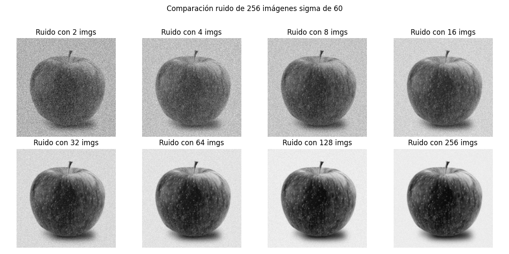
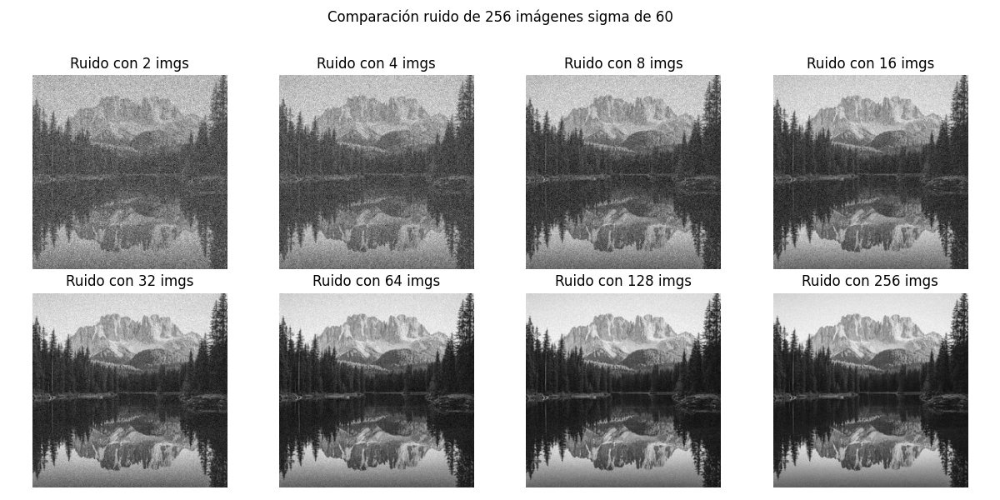
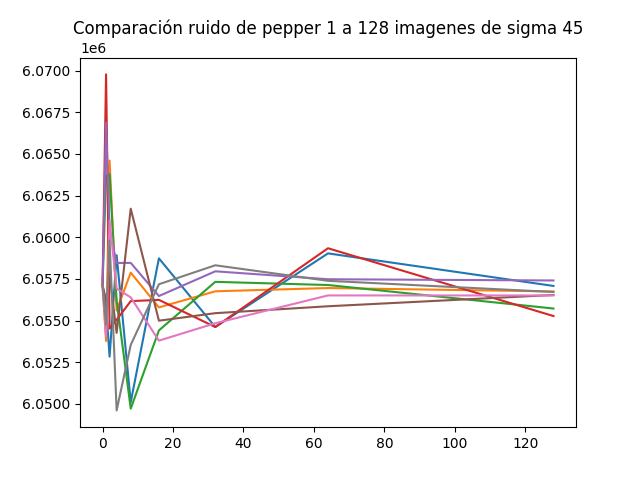

# Noise filtering
This program graphics how a noise filtering works by averaging the images "n" times and graphs how many images take to return a image without noise.

Basically with a random value and the number of images it will return its graphic of iterations of images.
Like this:

This showcase how the image starts to gradually loose noise with more iterations.

It also works with multiple images.

 
And showcasing a graph of how it works multiple times to see a how the program works.

